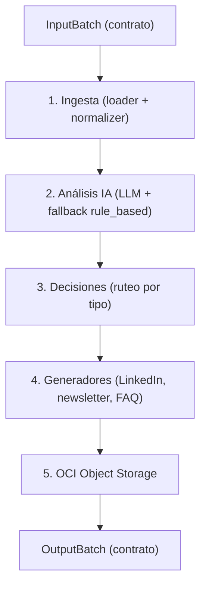

# 🚀 CommunityLab — Motor Inteligente de Transformación y Distribución para Comunidades Digitales

> **Hackathon ONE G10 — Oracle Next Education & Alura**
> Convierte la actividad orgánica de una comunidad digital en activos de marketing listos para publicar.

---

## 🎯 Qué es

CommunityLab ingiere interacciones de comunidades digitales (Discord, Slack, foros, Mastodon), las analiza con LLMs (sentimiento, temas, relevancia) y genera automáticamente **activos de distribución**: posts de LinkedIn, resúmenes de newsletter, FAQs y alertas de sentimiento. Todo se persiste en **OCI Object Storage** (capa Always Free).

---

## ⚠️ Estado actual (honesto)

| Módulo | Estado |
|---|---|
| Contrato de datos (modelos) | ✅ Listo |
| Cliente LLM (Gemini / OpenAI / Ollama / rule_based) | ✅ Listo |
| Ingesta (loader + normalizer) | ✅ Listo |
| Tests (incluido el del contrato) | ✅ 22 tests |
| Pipeline end-to-end | 🟡 Esqueleto con stubs |
| Análisis IA (sentimiento/temas/relevancia) | ❌ Pendiente |
| Motor de decisiones | ❌ Pendiente |
| Generadores (LinkedIn / newsletter / FAQ) | ❌ Pendiente |
| OCI Object Storage | ❌ Pendiente |
| Interfaz Streamlit | ❌ Pendiente |

> Este README describe el **objetivo**. El estado real se rastrea en los issues del repo.

---

## 📐 Contrato de datos (INNEGOCIABLE)

El sistema consume y produce **exactamente** estos JSON, definidos en el desafío. Los modelos de `src/domain/models.py` reflejan este contrato 1:1. **Si tocás un campo, corré `pytest tests/test_contract.py`.**

### Entrada

```json
{
  "origen_comunidad": "Discord_Grupo_ONE_G10",
  "periodo_referencia": "Semana_04",
  "interacciones": [
    { "autor": "Mariana Souza", "canal": "#logros-y-empleos", "tipo": "testimonio", "texto": "..." },
    { "autor": "Lucas Albuquerque", "canal": "#dudas-langgraph", "tipo": "pregunta_tecnica", "texto": "..." }
  ]
}
```

> **Clave:** el campo `tipo` es la señal que decide qué activo generar. No se pierde ni se re-infere.

### Salida

```json
{
  "status": "exito",
  "resumen_comunidad": { "total_interacciones_procesadas": 2, "sentimiento_predominante": "...", "temas_principales": ["..."] },
  "activos_distribucion_generados": {
    "post_linkedin": { "titulo": "...", "copy": "...", "canal_recomendado": "...", "potencial_engagement": "..." },
    "destaque_newsletter_semanal": { "seccion": "...", "titular": "...", "resumen": "..." },
    "sugerencia_contenido_faq": { "tema": "...", "origen": "...", "status": "..." }
  },
  "almacenamiento_oci": { "bucket": "communitylab-activos-marketing", "ruta_objeto": "...", "status": "guardado_con_exito" }
}
```

---

## 🏗️ Arquitectura



---

## 📁 Estructura del proyecto

```
communitylab/
├── src/
│   ├── domain/             # Modelos (contrato) + interfaces
│   ├── ingest/             # Loader + normalizer
│   ├── utils/              # Cliente LLM (gemini/ollama/openai/rule_based)
│   ├── analysis/           # Sentimiento, categorías, relevancia (pendiente)
│   ├── decisions/          # Motor de decisiones (pendiente)
│   ├── generators/         # LinkedIn, newsletter, FAQ (pendiente)
│   ├── oci/                # Object Storage (pendiente)
│   ├── interface/          # Streamlit (pendiente)
│   └── pipeline.py         # Orquestador end-to-end (esqueleto)
├── tests/                  # 22 tests
├── data/                   # Datos (raw/processed/sample)
├── docs/                   # Documentación
└── README.md
```

---

## 🚀 Cómo ejecutar

### Instalación

```bash
python3 -m venv venv
source venv/bin/activate
pip install -r requirements.txt
```

### Pipeline end-to-end (esqueleto)

```bash
python3 -m src.pipeline <archivo.json>
```

### Tests

```bash
python3 -m pytest tests/ -q
```

---

## ✅ Checklist MVP (del PDF)

- [x] Ingestión funcional de interacciones (loader + normalizer)
- [ ] Análisis de sentimiento y temas con LLMs
- [ ] Generación de 2+ formatos de activos
- [x] Cliente LLM común (Gemini/Ollama/rule_based)
- [ ] Integración OCI Object Storage
- [ ] Interfaz Streamlit
- [ ] Demo de 3+ ejemplos
- [x] Repositorio con documentación y diagrama

---

## 👥 Equipo

| Rol | Integrante | Módulos |
|---|---|---|
| Tech Lead / Backend | `emanuelperacchia` | Git, OCI, conexión Gemini, deploy |
| Revisora de código | `Rox-0864` | Contrato, pipeline, gate de merge |
| Backend | `Elias-J-Guardado` | Ingesta (Mastodon) |
| Data Science | `Yis-ai-eng` | Generadores + decisiones |
| Data Analyst | `mrolon09` | Interfaz Streamlit |
| Apoyo | `Antonio3051`, `itanflores` | Demo, docs, pruebas |

---

## 🏆 Roadmap

- [ ] Implementar análisis IA (sentimiento/categorías/relevancia)
- [ ] Implementar motor de decisiones (ruteo por `tipo`)
- [ ] Implementar generadores (LinkedIn/newsletter/FAQ)
- [ ] Integrar OCI Object Storage
- [ ] Conectar la interfaz Streamlit
- [ ] Demo final con 3+ ejemplos

---

*Proyecto del Hackathon ONE G10 — Oracle Next Education & Alura*
