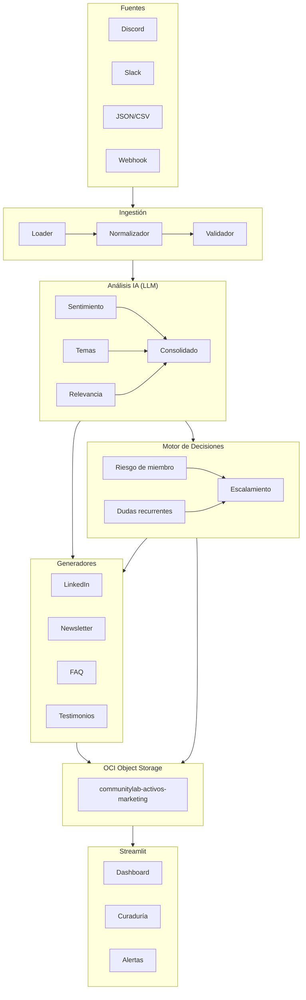

# 🚀 CommunityLab — Motor Inteligente de Transformación y Distribución para Comunidades Digitales

> **Hackathon ONE G10 — Oracle Next Education & Alura**
> Convierte la actividad orgánica de una comunidad digital en activos de marketing listos para publicar.

---

## 📋 Descripción

CommunityLab ingiere interacciones de comunidades digitales (Discord, Slack, foros, formularios), las analiza con LLMs (sentimiento, temas, relevancia) y genera automáticamente **activos de distribución** para marketing:

- 📣 **Posts para LinkedIn** con tono inspirador y hashtags
- 📧 **Resúmenes semanales** (Community Highlights) para newsletters
- ❓ **Tips y FAQs** a partir de dudas recurrentes
- 🏆 **Casos de éxito** y testimonios de estudiantes
- 🚨 **Motor de decisiones** (diferencial): alertas de sentimiento, detección de miembros en riesgo y derivación a mentorías

Todo se almacena en **OCI Object Storage** (capa Always Free).

---

## 🏗️ Arquitectura



> **Estado actual**: pipeline implementado end-to-end (ingesta webhook asíncrona → análisis → decisiones → generadores). Integración con OCI Object Storage en curso (pendiente cuenta/credenciales reales).

## 🤖 Proveedores de IA

CommunityLab no debe quedar limitado a un único modelo. El pipeline debe comunicarse con un **proveedor de IA** mediante una interfaz común, tanto para el análisis como para la generación de contenidos. De esta manera, el mismo flujo puede usar Gemini, OpenAI, OpenRouter u otro modelo compatible sin modificar la lógica de análisis, decisiones ni generación.

### Selección rápida del proveedor

El proveedor se elige configurando `LLM_BACKEND` en el archivo `.env`:

```env
# Gemini
LLM_BACKEND=gemini
GEMINI_API_KEY=tu_api_key_gemini

# OpenAI u otro endpoint compatible con la API de OpenAI
LLM_BACKEND=openai
OPENAI_API_KEY=tu_api_key_openai
OPENAI_BASE_URL=https://api.openai.com/v1
OPENAI_MODEL=gpt-4o-mini

# OpenRouter
LLM_BACKEND=openrouter
OPENROUTER_API_KEY=tu_api_key_openrouter
OPENROUTER_BASE_URL=https://openrouter.ai/api/v1
OPENROUTER_MODEL=modelo/seleccionado

# Demo sin API externa
LLM_BACKEND=rule_based
```

Con esta separación:

- `src/analysis/` solo pide el resultado del análisis al proveedor.
- `src/generators/` solo recibe el contexto y el tipo de activo que debe generar.
- Los prompts se mantienen en `src/prompts/`.
- Cambiar de proveedor no debería requerir modificar el orquestador, las reglas de decisión ni los formatos de salida.

### Contrato mínimo de un proveedor

Todo proveedor nuevo debe exponer dos capacidades:

```text
analyze(message) → sentimiento, categorías y relevancia
generate(asset_type, context) → contenido del activo
```

El proveedor puede ser Gemini, OpenAI, OpenRouter o un servidor local compatible con la API de OpenAI. Para modelos propios, basta con implementar ese contrato y registrar el proveedor en la configuración.

> **Estado actual:** el repositorio aún no incluye las implementaciones concretas de estos proveedores. Esta sección documenta el contrato y la forma de selección prevista para que la integración sea reemplazable sin acoplar el pipeline a un modelo específico.

---

## 📁 Estructura del proyecto

```
communitylab/
├── src/
│   ├── ingest/              # Carga y normalización de datos
│   ├── analysis/            # Sentimiento, temas, relevancia
│   ├── prompts/             # System prompts por canal
│   ├── orchestration/       # Pipeline + router condicional (full_analysis)
│   ├── generators/          # Generadores de activos (LinkedIn, FAQ, …)
│   ├── decisions/           # ⭐ Motor de decisiones (diferencial)
│   │   ├── engine.py        #   Reglas R1–R3 + resumen ejecutivo
│   │   ├── member_risk.py   #   Detector de miembros en riesgo (3 señales)
│   │   ├── recurring_topics.py  #   Dudas recurrentes ≥3 → mentoría
│   │   ├── escalation.py    #   Escalamiento INFO/MEDIO/ALTO/CRÍTICO
│   │   └── notifications.py #   Builders de notificaciones
│   ├── oci/                 # Integración OCI Object Storage
│   ├── interface/           # Streamlit (dashboard + panel de alertas)
│   ├── api/                 # API REST (webhook asíncrono + jobs)
│   ├── bot/                 # Bot Discord (pendiente ingreso/integración)
│   └── utils/               # LLM clients (Gemini/OpenAI/rule_based)
├── tests/                   # 38 tests (pytest)
├── data/sample/             # Demo: messages.json (5 interacciones)
├── scripts/                 # Descarga y preparación de datasets
├── notebooks/               # Notebooks exploratorios
├── n8n/                     # Workflows n8n (opcional)
├── docs/                    # datasets.md, DECISIONS.md
├── requirements.txt
└── README.md
```

---

## 🚀 Cómo ejecutar (guía rápida)

### Requisitos previos

| Recurso | Requisito | Cómo obtenerlo |
|---------|-----------|----------------|
| Python | 3.10+ | `sudo apt install python3` o pyenv |
| LLM API | Gemini/OpenAI key (opcional) | [aistudio.google.com](https://aistudio.google.com) |
| OCI | Cuenta Always Free (para guardar) | [signup.oracle.com](https://signup.oracle.com) |

> ⚡ **Demo sin API key**: el backend `rule_based` simula el LLM con reglas deterministas, pensado para demo, tests y CI. Sin él, el proyecto exige una key de Gemini u OpenAI.

### Instalación

```bash
cd communitylab
python3 -m venv venv
source venv/bin/activate
pip install -r requirements.txt
```

### Configuración

```bash
# Copiar plantilla de entorno
cp .env.example .env

# Para demo sin credenciales, activá el backend offline:
echo "COMMUNITYLAB_LLM_BACKEND=rule_based" >> .env
```


### 🖥️ Opción A — Dashboard Streamlit (recomendado para la demo)

```bash
COMMUNITYLAB_LLM_BACKEND=rule_based streamlit run src/interface/app.py
```

El dashboard permite: cargar el batch de ejemplo o subir un JSON, procesar el pipeline completo, y ver el **panel de alertas** (miembros en riesgo, mentorías, publicaciones prioritarias, FAQs) junto con los activos generados (posts LinkedIn, tips).

### 🌐 Opción B — API Webhook asíncrona

```bash
COMMUNITYLAB_LLM_BACKEND=rule_based uvicorn src.api.endpoints:app --port 8000
```

| Método | Ruta | Descripción |
|--------|------|-------------|
| `POST` | `/webhook` | Envía un lote; responde `202` + `job_id` al instante |
| `GET` | `/jobs/{job_id}` | Consulta el estado y resultado del job |
| `GET` | `/jobs` | Lista todos los jobs |
| `GET` | `/health` | Health check |

```bash
# Ejemplo de uso
curl -X POST http://localhost:8000/webhook \
     -H "Content-Type: application/json" \
     -d @data/sample/messages.json
# → {"status": "aceptado", "job_id": "0b0ded910dae"}

curl http://localhost:8000/jobs/0b0ded910dae
# → estado: pendiente/procesando/listo → resultado con decisiones
```

### ✅ Opción C — Tests

```bash
python3 -m pytest tests/ -q   # 38 tests
```

---

## 🔑 Ejemplo de uso (demo real)

**Entrada** — `data/sample/messages.json` (5 interacciones: empleo, duda técnica, frustración OCI, testimonio, logro):

```json
{
  "origen_comunidad": "Discord_Grupo_ONE_G10",
  "periodo_referencia": "Semana_04",
  "interacciones": [
    {
      "autor": "Mariana Souza",
      "canal": "#logros-y-empleos",
      "tipo": "testimonio",
      "texto": "Comunidad, quede seleccionada para el puesto de Desarrolladora Junior de IA!"
    }
  ]
}
```

**Salida real del pipeline** (actualizada a la implementación; con historial de ejemplo el panel muestra la historia completa):

| Detección | Acción generada |
|-----------|-----------------|
| Mariana consiguió empleo | 🚀 Post LinkedIn prioridad ALTA: *"Mariana Souza: un logro que inspira a la comunidad"* |
| Duda de LangGraph repetida 3× | 📝 FAQ + 📚 derivación al mentor de orquestación |
| João frustrado hace 3 semanas | ⚠️ ALERTA miembro: riesgo 67% → contactar individualmente |
| Testimonio de Carlos | 🚀 Segundo post prioritario |
| Feedback de Ana | 📧 Newsletter highlight |

---

## ✅ Checklist MVP (del PDF)

- [x] Ingestión funcional de interacciones (batch JSON + webhook asíncrono)
- [x] Análisis de sentimiento con LLMs (Gemini/OpenAI + fallback rule-based)
- [x] Generación de 2+ formatos de activos (LinkedIn, FAQ/tip, newsletter)
- [ ] Orquestación del flujo ~~(Python/LangGraph)~~ → implementado en Python puro (LangGraph como opción futura)
- [ ] Integración OCI Object Storage (código listo; falta credenciales reales)
- [x] Demo de 3 ejemplos de transformación (sample → decisiones → activos)
- [x] Repositorio con documentación y diagrama

---

## 👥 Equipo

> Roster actual: 4 integrantes (1 Data Analyst, 2 Data Scientists, 1 Backend). En espera de sumar más.

| Rol | Integrante | Módulos |
|-----|-----------|---------|
| Backend Developer | _(completar)_ | Git + OCI + API/webhook + bot Discord + deploy |
| Data Scientist 1 | _(completar)_ | Análisis + motor de decisiones (calibración) + unificación LLM |
| Data Scientist 2 | _(completar)_ | Prompts + generadores + calidad de activos |
| Data Analyst | _(completar)_ | Dashboard/analítica + testing + datasets + métricas |

---

## 📄 Licencias de datos

- Datos simulados: creados por el equipo (`data/sample/`)
- Datos reales: verificar licencia de cada dataset en `docs/datasets.md`; **discord scraping prohibido** — usar bot con permisos del admin o servidor propio

---

## 🏆 Diferenciales

- [x] **Motor de decisiones**: detección de miembros en riesgo + mentorías (implementado y testeado)
- [ ] Despliegue en OCI Compute
- [ ] Bot de Discord (código base en `src/bot/`; requiere acceso a servidor)
- [ ] Generación de imágenes
- [ ] Flujo n8n con webhooks
- [ ] LangGraph para orquestación condicional

---

*Proyecto del Hackathon ONE G10 — Oracle Next Education & Alura*