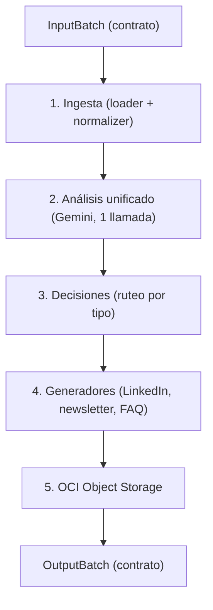

# 🚀 CommunityLab — Motor Inteligente de Transformación y Distribución para Comunidades Digitales

> **Hackathon ONE G10 — Oracle Next Education & Alura**
> Convierte la actividad orgánica de una comunidad digital en activos de marketing listos para publicar.

---

## 🎯 Objetivos

- **Ingerir** interacciones de comunidades digitales (Discord, Slack, foros, Mastodon).
- **Analizar** cada mensaje con LLMs (sentimiento, categoría, relevancia) en **una sola llamada**.
- **Decidir** automáticamente qué activo generar (LinkedIn, FAQ, newsletter) según el `tipo`.
- **Generar** los activos de marketing listos para publicar.
- **Persistir** todo en **OCI Object Storage** (capa Always Free).

---

## ⚠️ Estado actual

| Módulo | Estado |
|---|---|
| Contrato de datos (modelos) | ✅ Listo |
| Cliente LLM (Gemini / OpenAI / Ollama / rule_based) | ✅ Listo |
| Ingesta (loader + normalizer + Mastodon) | ✅ Listo |
| Detector de dudas recurrentes | ✅ Listo |
| Análisis unificado (sentimiento/categoría/relevancia) | 🟡 PR #73 (en review) |
| Motor de decisiones | ❌ Pendiente |
| Generadores (LinkedIn / newsletter / FAQ) | ❌ Pendiente |
| OCI Object Storage | 🟡 PR #76 (en review) |
| Interfaz Streamlit | 🟡 PR #74 (MVP) |
| Tests | ✅ 72 tests |

> Este README describe el **objetivo**. El estado real se rastrea en los issues del repo.

---

## 📐 Contrato de datos (INNEGOCIABLE)

El sistema consume y produce **exactamente** estos JSON, definidos en el desafío. Los modelos de `src/domain/models.py` reflejan este contrato 1:1. **Si tocás un campo, corré `pytest tests/test_contract.py`.**

### Entrada

```json
{
  "origen_comunidad": "Discord_Grupo_ONE_G10",
  "periodo_referencia": "Semana_04",
  "interacciones": [
    { "autor": "Mariana Souza", "canal": "#logros-y-empleos", "tipo": "testimonio", "texto": "..." },
    { "autor": "Lucas Albuquerque", "canal": "#dudas-langgraph", "tipo": "pregunta_tecnica", "texto": "..." }
  ]
}
```

> **Clave:** el campo `tipo` es la señal que decide qué activo generar. No se pierde ni se re-infere.

### Salida

```json
{
  "status": "exito",
  "resumen_comunidad": { "total_interacciones_procesadas": 2, "sentimiento_predominante": "...", "temas_principales": ["..."] },
  "activos_distribucion_generados": {
    "post_linkedin": { "titulo": "...", "copy": "...", "canal_recomendado": "...", "potencial_engagement": "..." },
    "destaque_newsletter_semanal": { "seccion": "...", "titular": "...", "resumen": "..." },
    "sugerencia_contenido_faq": { "tema": "...", "origen": "...", "status": "..." }
  },
  "almacenamiento_oci": { "bucket": "communitylab-activos-marketing", "ruta_objeto": "...", "status": "guardado_con_exito" }
}
```

---

## 🏗️ Arquitectura


```mermaid
flowchart TB
    IN["InputBatch (contrato)"] --> ING["1. Ingesta (loader + normalizer)"]
    ING --> ANL["2. Análisis unificado (Gemini, 1 llamada)"]
    ANL --> DEC["3. Decisiones (ruteo por tipo)"]
    DEC --> GEN["4. Generadores (LinkedIn, newsletter, FAQ)"]
    GEN --> OCI["5. OCI Object Storage"]
    OCI --> OUT["OutputBatch (contrato)"]
```

**Decisiones de diseño clave** (acordadas con la matriz de pruebas):
- El **contrato es la fuente de verdad** del vocabulario. Las categorías canónicas son `testimonio`, `pregunta_tecnica`, `feedback`, `logro`, `discusion`, `otro`.
- `duda_tecnica` es alias de `pregunta_tecnica`; `comentario_general` y `pregunta_general` mapean a `otro`.
- Ante fallo del LLM, el analizador devuelve un default seguro (neutral + `otro` + relevancia 0) y **nunca crashea**.

---

## 📁 Estructura del proyecto

```
communitylab/
├── src/
│   ├── domain/             # Modelos (contrato) + interfaces
│   ├── ingest/             # Loader + normalizer + Mastodon
│   ├── utils/              # Cliente LLM (gemini/ollama/openai/rule_based)
│   ├── analysis/           # Análisis unificado (GeminiUnifiedAnalyzer)
│   ├── decisions/          # Detector de dudas recurrentes (motor de decisiones: pendiente)
│   ├── generators/         # LinkedIn, newsletter, FAQ (pendiente)
│   ├── oci/                # Object Storage (en review)
│   ├── interface/          # Streamlit (MVP)
│   └── pipeline.py         # Orquestador end-to-end
├── tests/                  # 72 tests
├── data/                   # Datos (raw/processed/sample)
├── docs/                   # Documentación
└── README.md
```

---

## 🚀 Cómo ejecutar

### 1. Instalación

```bash
python3 -m venv venv
source venv/bin/activate
pip install -r requirements.txt
```

### 2. Configuración

Copiá `.env.example` a `.env` y completá:

```bash
COMMUNITYLAB_LLM_BACKEND=gemini   # gemini | openai | ollama | rule_based
GEMINI_API_KEY=...
```

> Sin credenciales, usá `COMMUNITYLAB_LLM_BACKEND=rule_based` (determinista, ideal para demos y CI).

### 3. Pipeline end-to-end

```bash
python3 -m src.pipeline data/sample/demo_fixed.json
```

### 4. Tests

```bash
python3 -m pytest tests/ -q
```

---

## 📚 Documentación

- [Arquitectura](docs/arquitectura.md)
- [Deploy y OCI](docs/deploy.md)
- [Análisis de datasets](docs/analisis_datasets.md)
- [Fichas de historias de usuario](docs/fichas-historias-usuario.md)
- [UI design](docs/ui-design.md)
- [Checklist de review](docs/review-checklist.md)
- [Guía de contribución](CONTRIBUTING.md)

---

## ✅ Checklist MVP (del PDF)

- [x] Ingestión funcional de interacciones (loader + normalizer)
- [x] Análisis unificado de sentimiento/categoría/relevancia (1 llamada LLM)
- [ ] Generación de 2+ formatos de activos
- [x] Cliente LLM común (Gemini/Ollama/rule_based)
- [ ] Integración OCI Object Storage
- [ ] Interfaz Streamlit
- [ ] Demo de 3+ ejemplos
- [x] Repositorio con documentación y diagrama

---

## 👥 Equipo

| Rol | Integrante | Módulos |
|---|---|---|
| Tech Lead / Backend | `emanuelperacchia` | Git, OCI, conexión Gemini, deploy |
| Revisora de código | `Rox-0864` | Contrato, análisis unificado, pipeline, gate de merge |
| Backend | `Elias-J-Guardado` | Ingesta (Mastodon) |
| Data Science | `Yis-ai-eng` | Decisiones + dudas recurrentes |
| Data Analyst | `mrolon09` | Interfaz Streamlit |
| Project Manager / QA | `itanflores` | Matriz de pruebas, QA, planificación |
| Documentación / Demo | `Antonio3051` | Docs finales, video demo |

---

## 🏆 Roadmap

- [ ] Motor de decisiones (ruteo por `tipo`)
- [ ] Generadores (LinkedIn/newsletter/FAQ)
- [ ] Integrar OCI Object Storage
- [ ] Conectar la interfaz Streamlit
- [ ] Demo final con 3+ ejemplos

---

*Proyecto del Hackathon ONE G10 — Oracle Next Education & Alura*
