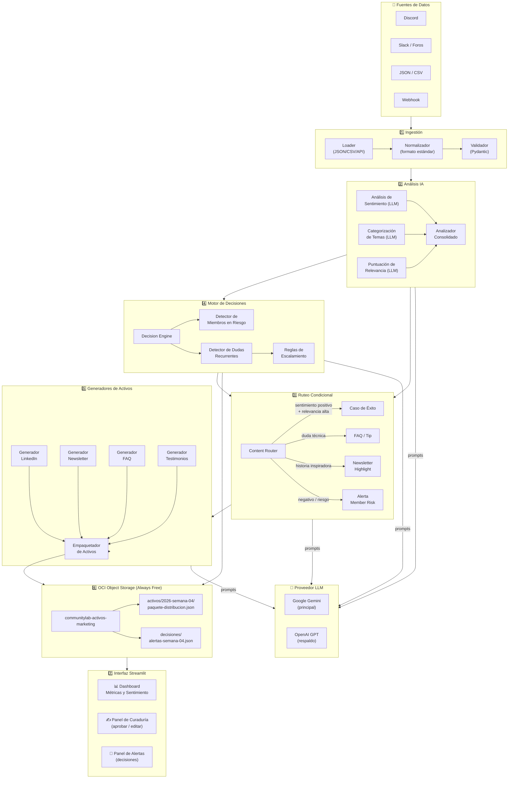
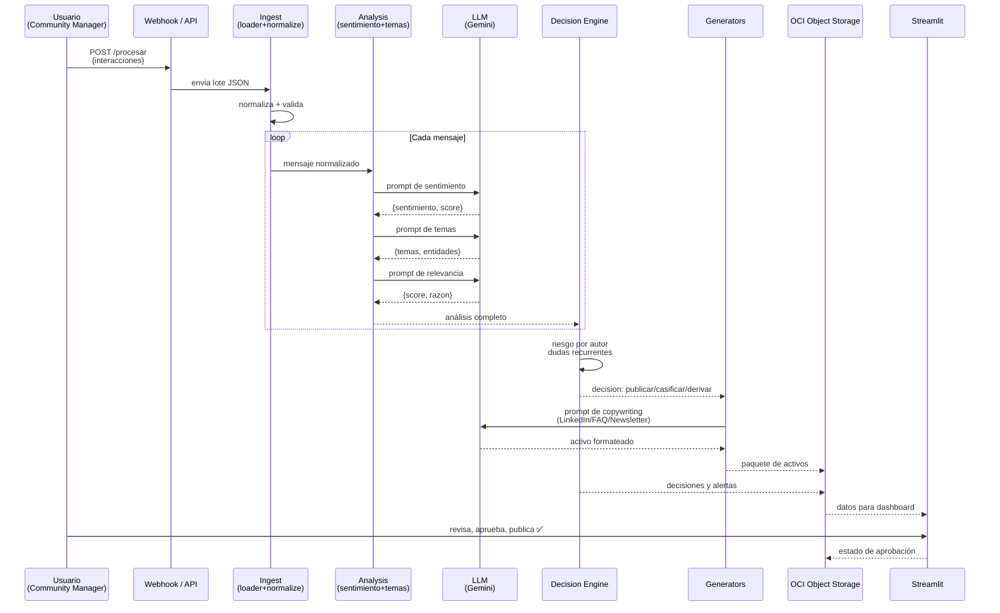
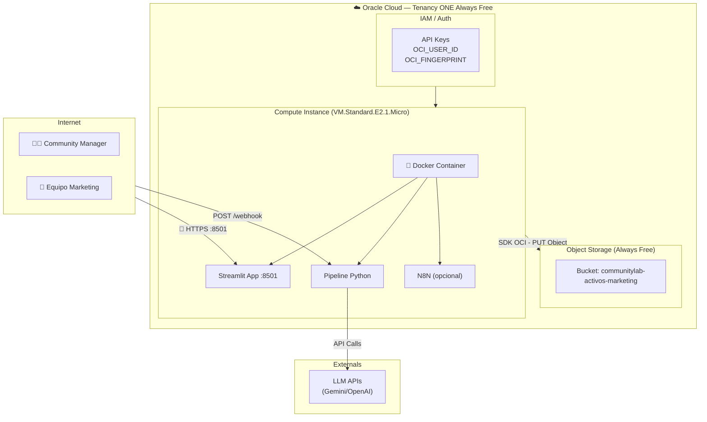
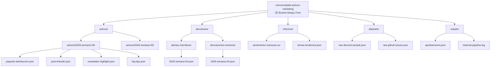
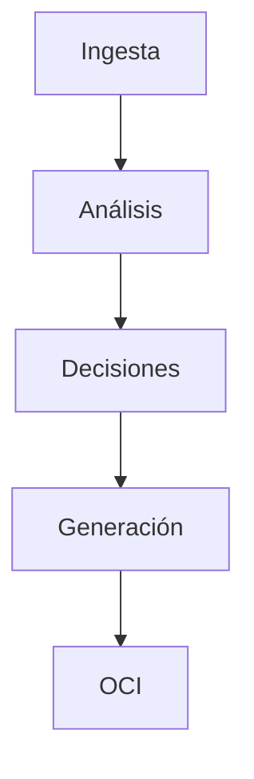

# 🏗️ ARQUITECTURA — CommunityLab

> Diagramas en Mermaid, listos para incrustar en el README.md del repositorio.
> Usar con GitHub (soporta Mermaid nativo) o renderizar en mermaid.live.

---

## 📐 DIAGRAMA 1: VISTA GENERAL DEL PIPELINE (para el README principal)



---

## 🧩 DIAGRAMA 2: COMPONENTES DETALLADOS (para docs/architecture.md)

```mermaid
flowchart LR
    subgraph FRONT["🎨 Frontend (Streamlit)"]
        UI_APP["app.py"]
        UI_DASH["pages/1_dashboard.py"]
        UI_CUR["pages/2_curaduria.py"]
        UI_GEN["pages/3_generar.py"]
        UI_CFG["pages/4_config.py"]
    end

    subgraph API["🔌 API Layer"]
        API_EP["src/api/endpoints.py"]
        API_HEALTH["src/api/health.py"]
    end

    subgraph CORE["⚙️ Core Pipeline"]
        PIPE["src/orchestration/pipeline.py"]
        ROUTER2["src/orchestration/router.py"]
        STATE["src/orchestration/state.py"]
    end

    subgraph ING["📥 Ingest"]
        LDR["src/ingest/loader.py"]
        NRM["src/ingest/normalizer.py"]
        VAL["src/ingest/validators.py"]
    end

    subgraph ANL["🧠 Analysis"]
        SENT["src/analysis/sentiment.py"]
        CAT["src/analysis/categorization.py"]
        REL["src/analysis/relevance.py"]
        ORCH["src/analysis/orchestrator.py"]
    end

    subgraph PRM["💬 Prompts"]
        P_SENT["sentiment_prompts.py"]
        P_LINK["linkedin_prompts.py"]
        P_NEWS["newsletter_prompts.py"]
        P_FAQ["faq_prompts.py"]
        P_TMP["templates.py"]
    end

    subgraph GEN["✍️ Generators"]
        G_LINK["linkedin_generator.py"]
        G_NEWS["newsletter_generator.py"]
        G_FAQ["faq_generator.py"]
        G_TEST["testimonial_generator.py"]
    end

    subgraph DEC["🧭 Decisions"]
        D_ENGINE["src/decisions/engine.py"]
        D_RISK["member_risk.py"]
        D_REC["recurring_topics.py"]
        D_ESC["escalation.py"]
        D_NOTIF["notifications.py"]
    end

    subgraph OCI["☁️ OCI (Always Free)"]
        O_CLIENT["src/oci/oci_client.py"]
        O_STORE["src/oci/storage.py"]
        O_PERSIST["src/oci/persistence.py"]
        O_BUCKET["📦 Bucket:\ncommunitylab-activos-marketing"]
    end

    subgraph LLMS["🌐 LLM Providers"]
        L_GEMINI["Gemini"]
        L_OPENAI["OpenAI (resp)"]
    end

    FRONT -->|"HTTP"| API
    API --> CORE
    CORE --> ING
    CORE --> ANL
    CORE --> GEN
    CORE --> DEC
    ANL --> PRM
    GEN --> PRM
    DEC --> PRM
    ANL -->|"análisis"| DEC
    DEC -->|"decisiones"| CORE
    GEN -->|"activos"| OCI
    DEC -->|"alertas"| OCI
    PIPE --> O_PERSIST
    O_CLIENT --> O_STORE --> O_BUCKET
    ANL -->|"prompts + respuestas"| LLMS
    GEN -->|"prompts + respuestas"| LLMS
    DEC -->|"prompts + respuestas"| LLMS
```



---

## 🔄 DIAGRAMA 3: FLUJO DE DATOS TÉCNICO (JSON in → JSON out)



---

## 🏛️ DIAGRAMA 4: DESPLIEGUE (SI usan OCI Compute — opcional/diferencial)



---

## 📊 DIAGRAMA 5: BUCKET OCI — Estructura de objetos



---

## 📋 INSTRUCCIONES DE USO EN EL README

### Para GitHub (render nativo):
```markdown

```

GitHub renderiza Mermaid automáticamente en Markdown desde 2025.

### Para la presentación ejecutiva:
Exportar desde:
- [mermaid.live](https://mermaid.live) → PNG/SVG de alta calidad
- O usar [Mermaid Ink](https://mermaid.ink) para generar URLs de imágenes

### Alternativa offline (sin Mermaid):
Generar el diagrama con **draw.io** (free) usando los mismos componentes. La versión Mermaid es el estándar recomendado.

---

## 🎯 Resumen de decisiones de arquitectura (para DECISIONS.md)

| Decisión | Opción elegida | Alternativa | Por qué |
|----------|----------------|-------------|---------|
| Orquestación | Python puro + async | n8n | Mayor control, testing fácil, integración directa con módulos |
| LLM principal | Google Gemini | OpenAI | Gratis y generoso en capa free, bueno en español/portugués |
| Interfaz | Streamlit | Gradio | Mejor para paneles de curaduría con estado |
| Persistencia | OCI Object Storage | Base de datos | Requisito obligatorio del hackathon + compatible con Always Free |
| Módulo de decisiones | Reglas + LLM híbrido | Solo LLM | Determinismo en reglas críticas + contexto en matices |
| Deploy | Local + OCI opcional | Solo OCI | MVP rápido + diferencial si hay tiempo |

---

*Arquitectura creada para equipo CommunityLab — Oracle ONE Hackathon G10*
*Los diagramas 1-5 están listos para pegar en los documentos del repo.*